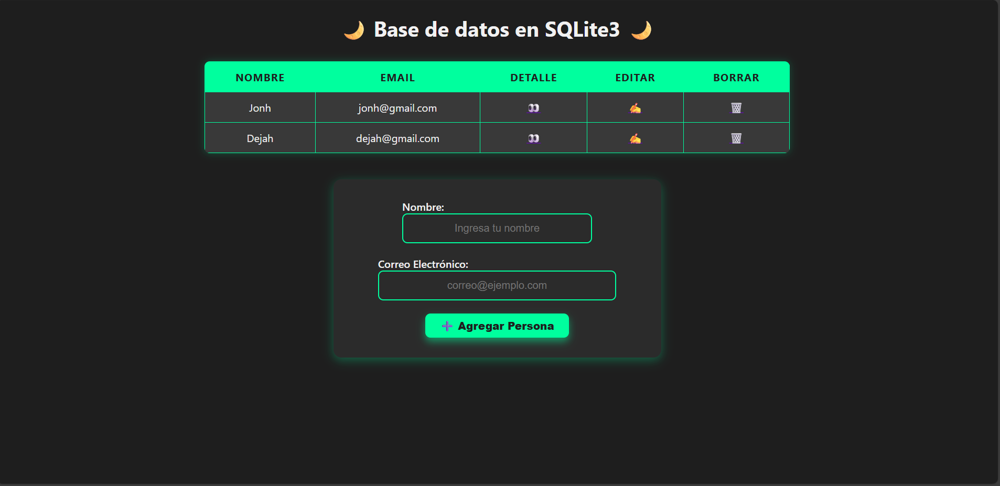
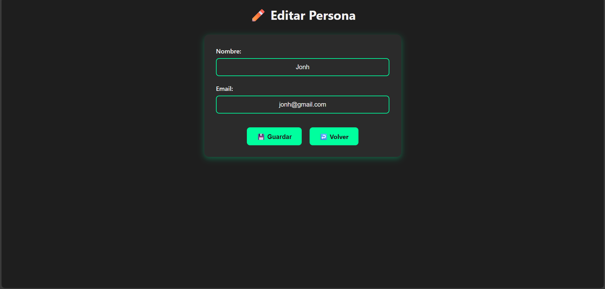
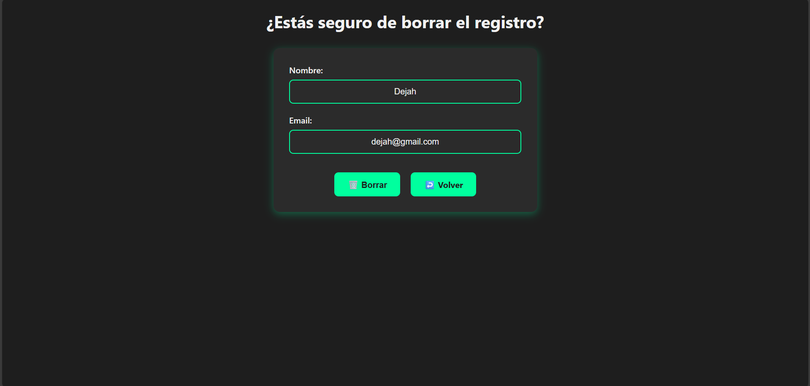

# Proyecto CRUD con SQLite3 y Web.py

  
  
  

---

## Descripción

Este proyecto es una aplicación web sencilla para gestionar un listado de personas utilizando SQLite3 como base de datos y el framework Web.py para el backend. Permite **crear**, **leer**, **actualizar** y **eliminar** registros (CRUD) de personas con nombre y correo electrónico.

El diseño es moderno, con un estilo oscuro por defecto y transiciones suaves para mejorar la experiencia de usuario.

---

## Características

- Listado de personas con sus nombres y correos electrónicos.
- Vista detallada de cada persona.
- Edición y actualización de registros.
- Confirmación antes de borrar un registro.
- Interfaz amigable y responsive con estilo dark mode.
- Formularios con validación básica y placeholders.
- Botones con animaciones y efectos hover.
- Código modular y reutilizable con templates separados.

---

## Tecnologías utilizadas

- **Python 3**
- **Web.py** (framework web ligero)
- **SQLite3** (base de datos embebida)
- **HTML5 / CSS3** (con diseño moderno y dark mode)
- **Jinja-like templates** de Web.py para separar lógica y presentación

---

## Estructura del proyecto

/agenda.db                 # Base de datos SQLite3  
/app.py                   # Archivo principal con rutas y lógica  
/views/                   # Carpeta con templates HTML  
  personas.html  
  detalle.html  
  editar.html  
  borrar.html  
/static/  
  styles.css               # Archivo CSS con estilos modernos y dark mode  
/agenda.sql                # Script para crear la base y registros iniciales  
README.md                  # Este archivo  

---

## Instalación y ejecución

1. Clona el repositorio:

```bash
git clone https://github.com/tu-usuario/tu-repo.git

cd tu-repo
```

2. Crea un entorno virtual (opcional pero recomendado):

```bash
python3 -m venv venv

source .venv/bin/activate 
```

3. Instala Web.py:

```bash
pip install web.py
```

4. Crea la base de datos si no existe:

```bash
sqlite3 agenda.db < agenda.sql
```

5. Ejecuta la aplicación:

```bash
sudo python app.py 80
```

---

## Uso

- **Agregar Persona:** Completa el formulario en la página principal y presiona \"➕ Agregar Persona\".
- **Ver Detalles:** Haz click en el icono 👀 para ver detalles de una persona.
- **Editar Persona:** Haz click en ✍️ para modificar datos.
- **Borrar Persona:** Haz click en 🗑️ y confirma el borrado.

---

## Capturas del proyecto

Pantalla principal con listado de personas:



Editar una persona:



Confirmar borrado:



---

## Autor

**[Milton Espinosa](https://github.com/MEsp1)**  
[GitHub](https://github.com/MEsp1) | [Email](mailto:milton_lies@outlook.es)

---

## Licencia

Este proyecto está bajo la licencia MIT. Consulta el archivo LICENSE para más detalles.